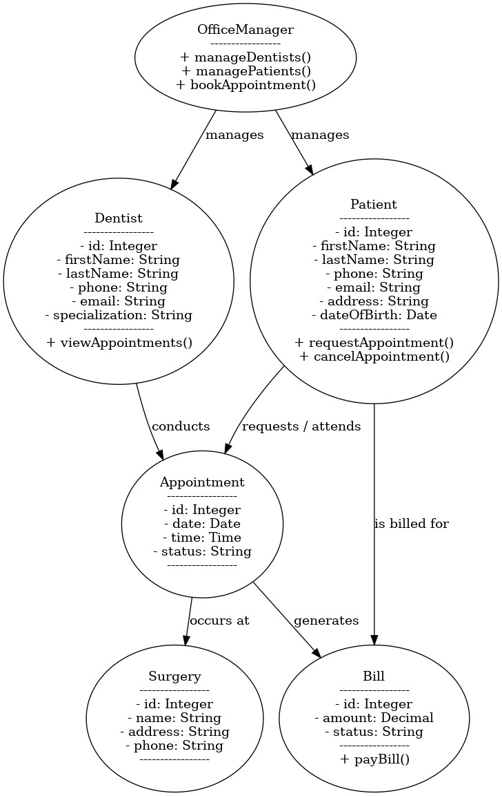

### 1.1 Software Requirements Discovery (Functional Requirements)

1. Dentist Registration: The Office Manager can register dentists with a unique ID, name, contact details, and specialization.
2. Patient Enrollment: The Office Manager can enroll patients, recording their personal details and contact information.
3. Appointment Requests: Patients can request appointments via phone or an online form.
4. Appointment Booking: The Office Manager can book appointments for patients and notify them via email.
5. Appointment View (Dentists): Dentists can sign in to view their scheduled appointments, including patient details.
6. Appointment View (Patients): Patients can sign in to view their scheduled appointments, including dentist details.
7. Surgery Information: The system provides information about surgery locations, including name, address, and contact details.
8. Appointment Restrictions: A dentist cannot have more than 5 appointments in a week.
9. Outstanding Bills: Patients cannot request new appointments if they have unpaid bills.
10. Appointment Management: Patients can request to cancel or change their appointments.

### 1.2 System Analysis & Design (Domain Model UML Class Diagram)
The domain model will include the following main classes:

- OfficeManager: Handles dentist registration, patient enrollment, and appointment booking. 
- Dentist: Attributes include unique ID, name, contact info, specialization; relationships to appointments. 
- Patient: Attributes include name, contact info, mailing address, date of birth; relationships to appointments and bills. 
- Appointment: Attributes include date, time, status; relationships to dentists, patients, and surgeries. 
- Surgery: Attributes include name, location, and contact details. 
- Bill: Attributes include amount, status, patient association. 

Relationships and multiplicities:
- An OfficeManager manages multiple Dentists and Patients.
- A Dentist has up to 5 Appointments per week. 
- A Patient can have multiple Appointments, but only one can be active at a time. 
- An Appointment is associated with one Surgery, one Dentist, and one Patient. 
- A Patient has zero or more Bills.

### 1.3 UML Diagram

