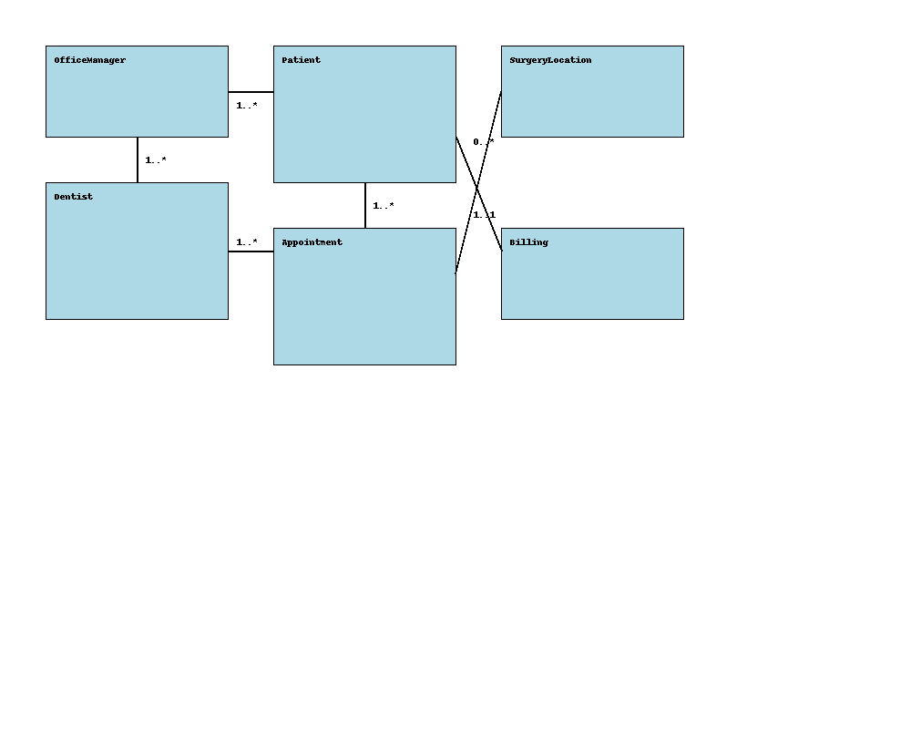

### Task 1.1: Functional Requirements

1. **User Authentication and Authorization:**
    - The system should allow Office Managers to register new Dentists with details including ID, first name, last name, phone number, email, and specialization.
    - The system should allow the Office Manager to enroll new Patients with details including first name, last name, phone number, email, mailing address, and date of birth.
    - Dentists and Patients should be able to log into the system to view relevant information.

2. **Appointment Scheduling and Management:**
    - The system should allow Patients to request appointments via a call or online form.
    - The Office Manager should be able to schedule appointments based on requests and send confirmation emails to Patients.
    - The system should store each appointment with details such as appointment date, time, dentist, patient, and surgery location.
    - Dentists should be able to view a list of all their scheduled appointments, including Patient details.
    - Patients should be able to view their upcoming appointments, including details about the dentist they’re scheduled to see.
    - Patients should have the option to request appointment cancellation or rescheduling.

3. **Scheduling Constraints:**
    - The system should restrict a Dentist from being assigned more than 5 appointments in a given week.
    - The system should prevent a Patient from requesting a new appointment if they have any outstanding, unpaid bills.

4. **Surgery Information:**
    - The system should provide information about each Surgery location, including the name, address, and contact number.

5. **Billing and Payment Status:**
    - The system should allow the Office Manager to update billing and payment status for Patients.
    - Patients should be notified if they have an outstanding bill and be unable to book new appointments until it is resolved.

---

### Task 1.2: Domain model UML Class diagram
